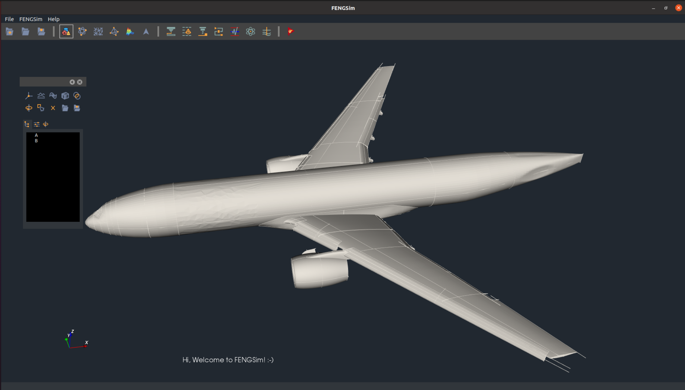
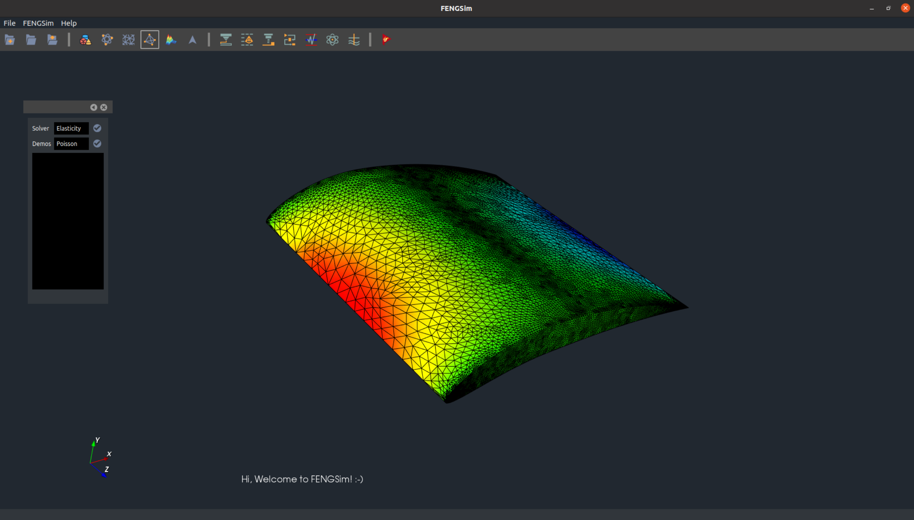

# 关于OpenDigitalTwin项目

数字孪生要建立贯穿产品全生命周期的闭合优化回路，目的是为了提高工业机理研发水平和效率，CAX软件是数字孪生的核心技术，这样就可以实现星际跳跃了。

OpenCAXPlus项目（OCP）是由KAUST-SRIBD科学计算与机器学习联合中心（港中深、深圳大数据研究院、深圳工业与应用数学中心）发起的，目的是收集开源软件形成完整知识体系，提供面向CAX的软件开发工具（SDK），实现开发环境一键式部署，提供全部源代码、开发工具、软件架构和案例，提供CICD和应用商店，让算法和工业机理研究者更容易将成果转化成软件产品。在OpenCAXPlus基础上，提供面向行业重大应用的软件开发工具，如增材制造、复合材料、测量，既OpenDigitalTwin项目（ODT）。OCP和ODT均为开源项目，欢迎更多伙伴参与。

请注意，开源的意义更多是开发工具，并不是软件产品。有了卓越的开发工具、生态环境和人才，才能开发卓越产品。请勿把OCP和ODT等同于软件产品，而是我们对开源软件以及数学、物理和计算机知识的系统性学习和分享。

