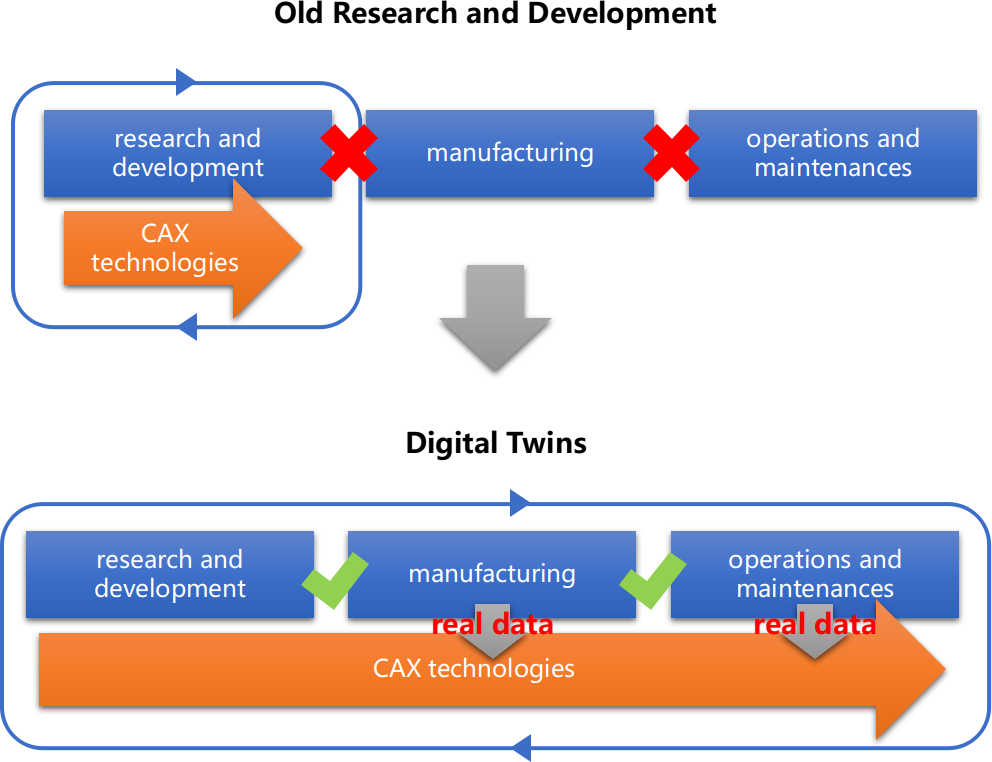
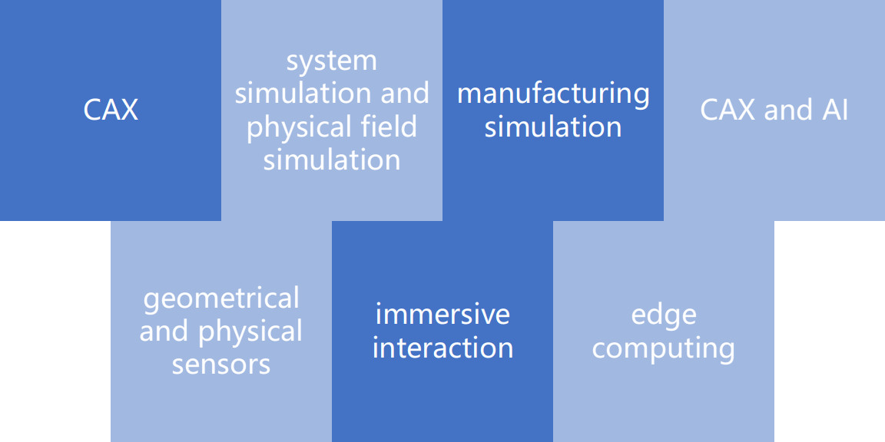
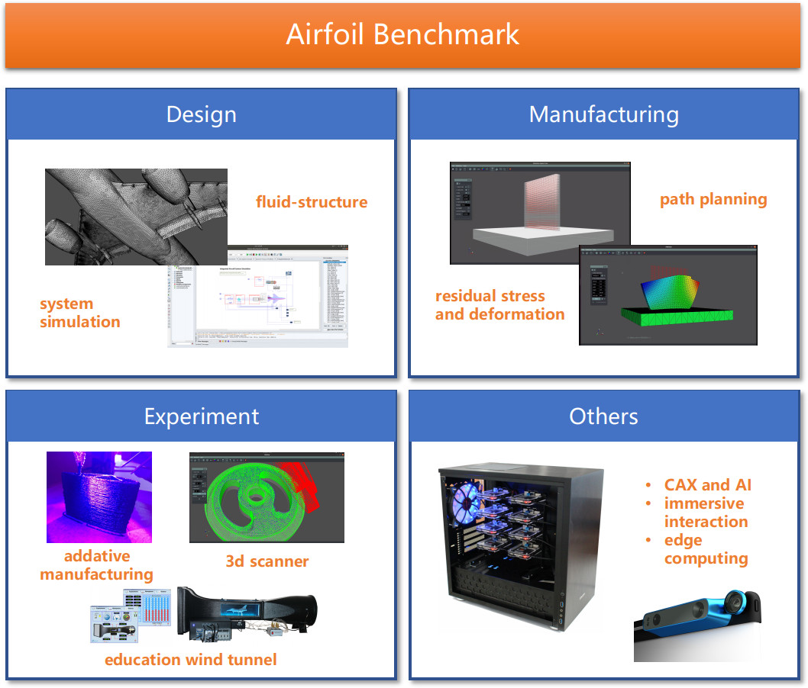
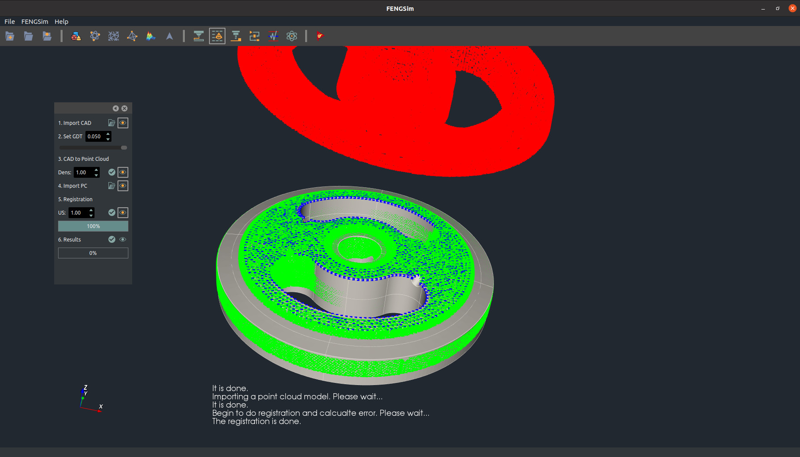

# About Open Digital Twin Project

Digital twins need all CAX technologies. Without a large team and big money, it is normally difficult and nearly impossible to develop a digital twin system like Siemens TeamCenter, Dassault 3D Experience, and Ansys WorkBench. But we’ve proven that open-source software is a good solution to this and it brings its products directly to the industrial sector. The Open Digital Twin Project includes FENGSim, FASP, and OpenCAEPoro. FENGSim was initiated by Prof. Anders Logg and Dr. Jiping Xin. FASP and OpenCAEPoro were initiated by Associate Prof. Chensong Zhang.

数字孪生需要融合全部CAX技术，在过去的二十年中，德国西门子公司、法国达索公司和美国ANSYS公司花费巨资并购形成了各自的数字孪生平台，分别为西门子Team Center、达索3D Experiences和ANSYS WorkBench。我们充分验证了基于开源软件也可以形成同样的数字孪生系统并开发工业级应用。目前开源数字孪生项目（Open Digital Twin）包括FENGSim、OpenCAEPoro、FASP三部分。FENGSim由Anders Logg教授和信吉平博士发起，FASP和OpenCAEPoro由张晨松副研究员发起。

# Why Digital Twins?

# Technologies in Digital Twins

# [Airfoil Benchmark](https://github.com/fengsim/FENGSim-Dev/wiki/Home)

Here we show you how to develop your own digital twin project by introducing the Airfoil benchmark.   

# Applications

## Manufacturing

## Additive Manufacturing

## Composite Materials

## Measurement

