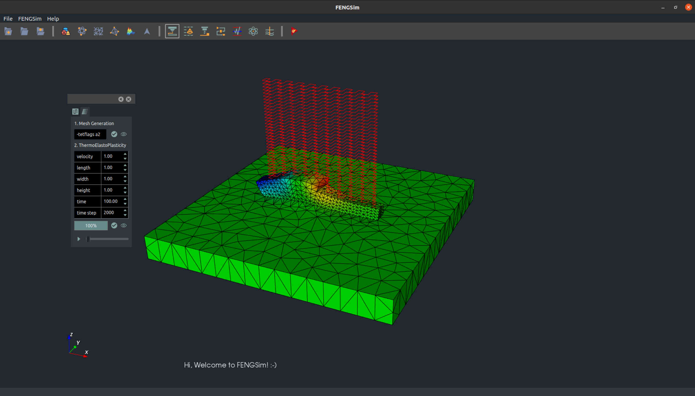
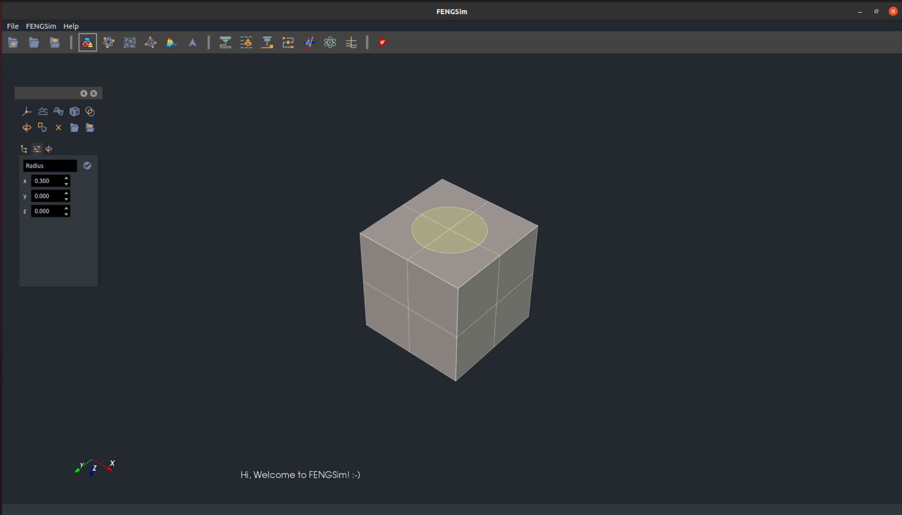
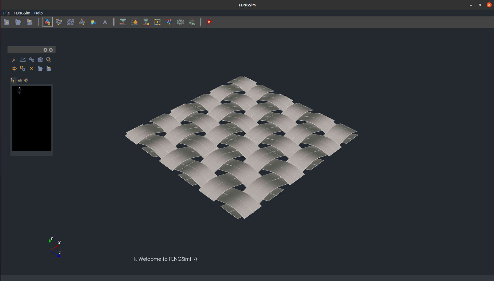
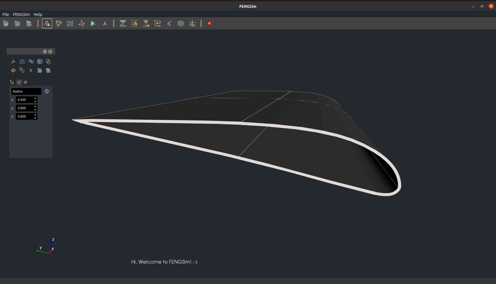
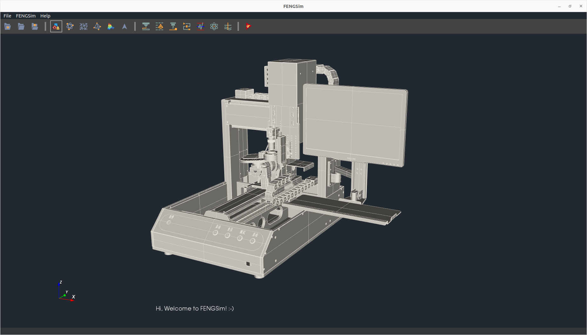
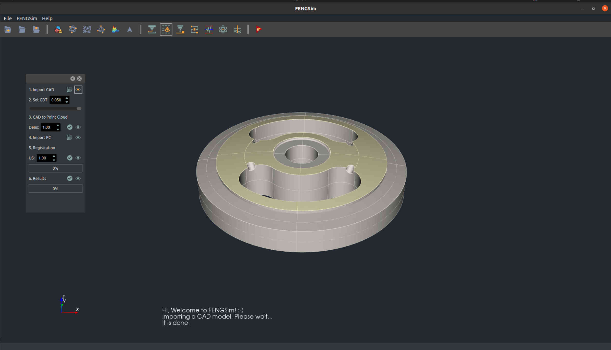
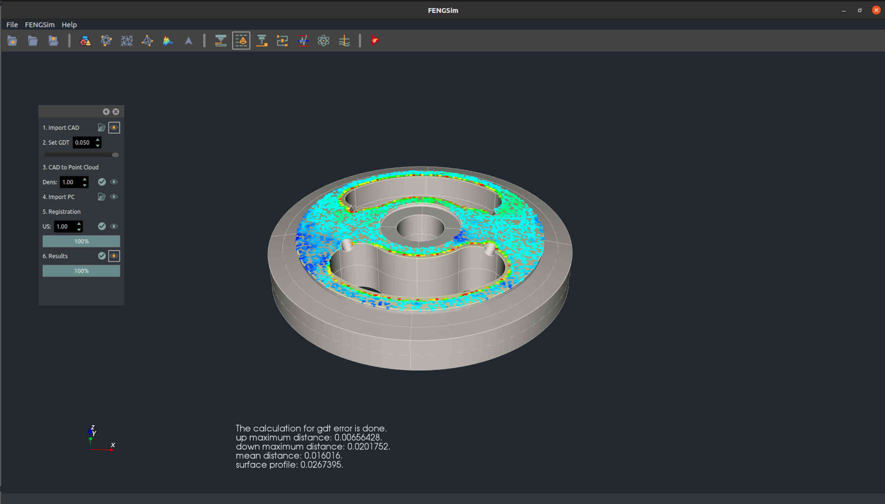
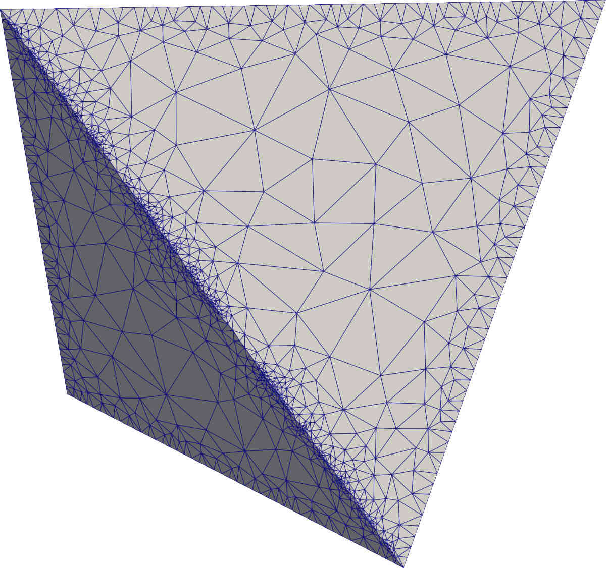
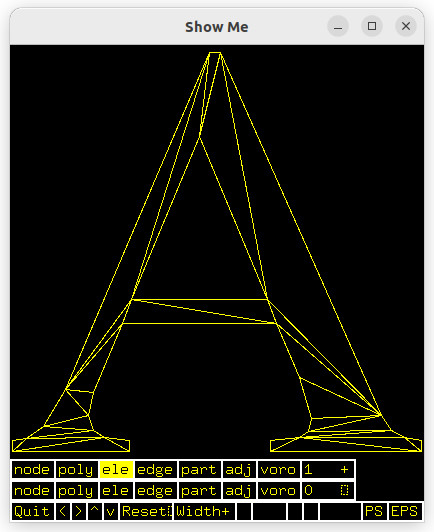

# [OpenDigitalTwin](https://ocp-docs.readthedocs.io)

To install:
1. Navigate to the cli directory in your terminal/command prompt.
2. Run the install script by entering:
    ./install.sh
3. Once installation is complete, launch QtCreator with:
    ./qtcreator.sh 
4. In QtCreator, open the FENGSim.pro project file located at:
    starters/FENGSim/FENGSim.pro
5. Build the prepost module project in QtCreator.

The product life cycle includes design, manufacturing, operation, and maintenance. In the past, optimization of products focused on the design phase, often overlooking issues that arose in manufacturing, operation, and maintenance. This is where digital twins can help - by extending optimization across the entire product lifecycle. With digital twins, problems can be identified and solved not just in design, but even after production during real-world use. This allows products to be greatly improved through rapid iteration. Digital twins may thus accelerate innovations like manned missions to Mars. 

The core of digital twin technology is CAX - computer-aided design, engineering, manufacturing, and inspection. Our OpenCAXPlus project studies open-source software, physics, mathematics, and computer science to build a knowledge system for digital twins. We have collected numerous open-source tools to develop a software development toolkit (SDK). This SDK is very easy to use - with one command, users can access the full development environment including code, tools, frameworks, and example cases. Researchers in algorithms and mechanics can build solutions much more easily.

Based on this SDK, we are developing the OpenDigitalTwin project for key applications like additive manufacturing, composite materials, robotics, and metrology. You are welcome to join the OpenCAXPlus project and OpenDigitalTwin project.

System solutions for complex products, algorithms, and applications !
   
# Additive Manufacturing

# Composite Materials

# Robotics

# Metrology

# Incubator

We have connections with many incubators. If you would like to obtain financial support, please contact us.

# [Logs](./logs/logs.md)

1. FENGSim
   * qt5->qt6 (...)
   * vtk8->vtk9 (...)
   
2. Mesh Generation
   * cgal 2d/3d triangulation and meshing (2023-08-23)

	

   
   

   
   * triangle (2023-09-23)
   
   

   
   

   
3. Contact
   * Hello World! (2023-09-13)
   
   

   
   

   
   

   
   

   
   

   
   

   
   

   
   

   
   * Domain Decomposition Method, the Poisson equation (2023-08-23)
   * Domain Decomposition Method, the elasticity equation (...)
   
4. ROS 
   * <mark>ros-dev-tools</mark> from <mark>infra-variants</mark> in <mark>ros-infrastructure</mark>
	 > This repository contains package configuration information and automation for the ROS Infrastructure variant packages. Currently there are two variants used for ROS Infrastructure. ros-build-essential contains the base set of packages to be present when building any ROS package on the build farm. ros-dev-tools contains packages that are of general use to ROS developers but which are not dependencies of any particular packages within a ROS distribution.
   * <mark>rosdep</mark> in <mark>ros-infrastructure</mark>
	 >rosdep is a command-line tool for installing system dependencies. For end-users, rosdep helps you install system dependencies for software that you are building from source. For developers, rosdep simplifies the problem of installing system dependencies on different platforms. Instead of having to figure out which debian package on Ubuntu Oneiric contains Boost, you can just specify a dependency on 'boost'.
   * <mark>colcon</mark>
	 >colcon is a command line tool to improve the workflow of building, testing and using multiple software packages. It automates the process, handles the ordering and sets up the environment to use the packages.
   * <mark>vcstool</mark>
	 >Vcstool is a version control system (VCS) tool, designed to make working with multiple repositories easier.
   * MoveIt sources and compilation (...)
   * Navigation sources and compilation (...)
