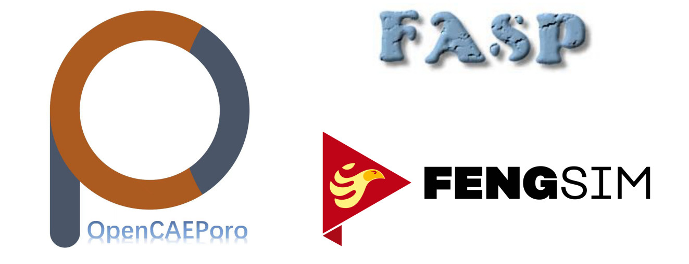

# About Open Digital Twin Project

Digital Twins need all CAX technologies. Without a large team and big money, it is normally difficult and nearly impossible to develop a digital twin system like Siemens Digital Industries Software, Dassault 3D Experience, and Ansys WorkBench. But we've proven that open source software is definitely a solution to this and it brings its products directly to industries. The Open Digital Twin Project includes FENGSim, FASP, and OpenCAEPoro. FENGSim was initiated by Prof. Anders Logg, Dr. Jiping Xin, Mr. Bin Duan, Associate Prof. Yuqing Peng, Mr. Zhuang Zhang, Prof. XB Liu and Prof. Chaofeng Zhang from 2016. FASP and OpenCAEPoro were initiated by Associate Prof. Chensong Zhang.

# Why Digital Twins?

# [Cosmic Cube](https://github.com/OpenDigitalTwin-Dev/OpenDigitalTwin/wiki/Home)
By using just one command, you could open the door to the world of CAX and Digital Twins. 

`/bin/bash -c "$(curl https://raw.githubusercontent.com/OpenDigitalTwin-Dev/OpenDigitalTwin/main/cube)"`

You will get all the codes of CAX software and the development environment. The Cosmic Cube can be used for the development of CAX, BIM, MBD, EDA, Visualization, AR/VR, Virtual City, Digital Twin and Metaverse.

# [Airfoil Benchmark](https://github.com/OpenDigitalTwin-Dev/OpenDigitalTwin/wiki/Home)

Here we show you how to develop your own digital twin by the Airfoil Benchmark.   

# Industrial Applications

## Machining

## Additive Manufacturing

## Composite Materials

## Measurement

## Biomedical Engineering
