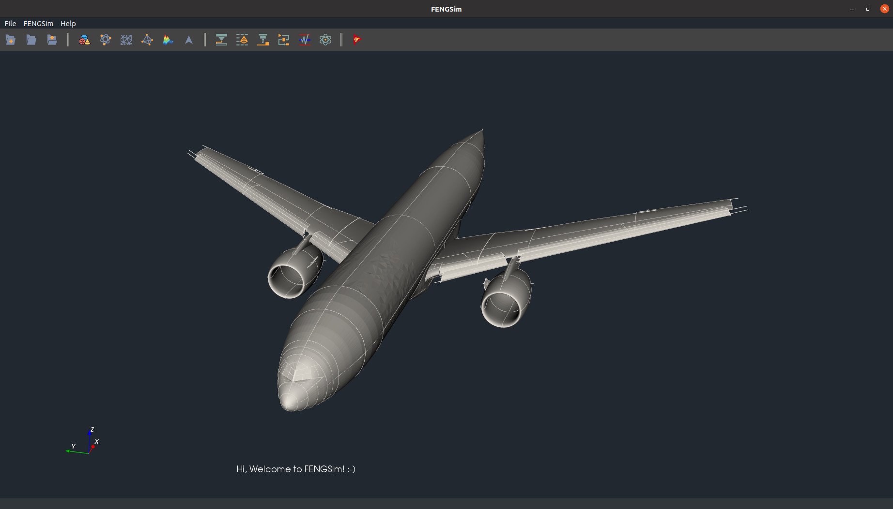
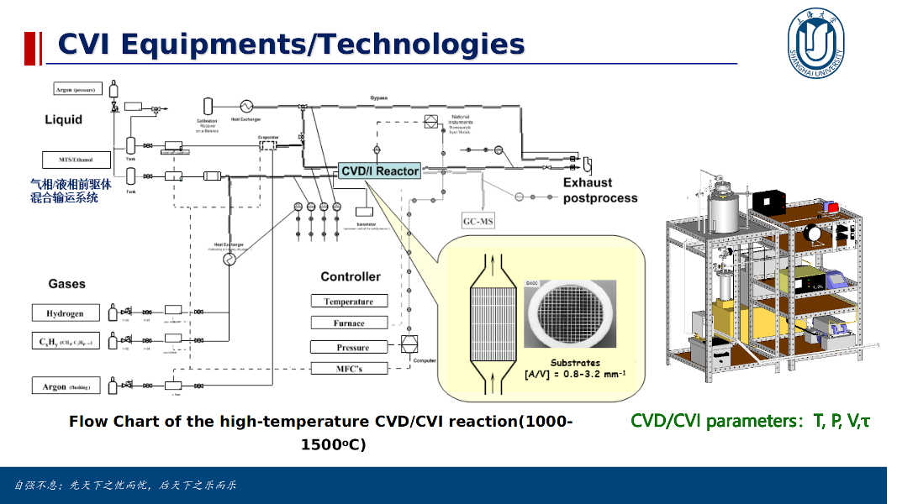
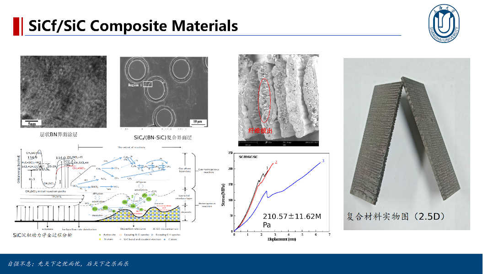

# About Open Digital Twin Project

This project is for the future of the industry. The true digital twins need all CAX technologies. Without a large team and big money, it is normally difficult and nearly impossible to develop a digital twin system like Siemens Digital Industries Software, Dassault 3D Experience, and Ansys WorkBench. But we've proven that open source software is definitely a solution to this and it brings its products directly to industries. The Open Digital Twin Project includes FENGSim, OpenCAE+, OpenPFEM, FASP and GCGE. FENGSim was started by Prof. Anders Logg and Dr. Jiping Xin with the support from many friends as Mr. Bin Duan, Associate Prof. Yuqing Peng, Mr. Zhuang Zhang, Mr. Xuebo Liu from 2016. FASP and OpenCAE+ were started by Associate Prof. Chensong Zhang. GCGE and OpenPFEM were started by Prof. Hehu Xie. 

# Why Digital Twins?

# FENGSim 

## [Cosmic Cube (CAX IDE)](https://github.com/OpenDigitalTwin-Dev/OpenDigitalTwin/wiki/Home)
By using just one command, you could open the door to the world of CAX and Digital Twins. 

`/bin/bash -c "$(curl https://raw.githubusercontent.com/OpenDigitalTwin-Dev/OpenDigitalTwin/main/cube)"`

You will get all the codes of CAX software and the integrated development environment. The Cosmic Cube can be used for the development of CAX, BIM, MBD, MBSE, EDA, Visualization, AR/VR, Virtual City, Digital Twin and Metaverse.

## [Airfoil Benchmark (Framework)](https://github.com/OpenDigitalTwin-Dev/OpenDigitalTwin/wiki/Home)

Here we show you how to develop your own digital twin by the Airfoil Benchmark.   

# OpenCAE+

## OpenCAEPoro

# FASP

# OpenPFEM

# GCGE

# Industrial Applications

## Machining

## Additive Manufacturing

## Composite Materials

by Associate Professor Yuqing Peng and Professor Aijun Li from Shanghai University 

## Measurement

## Transport Theory

## Medicine

