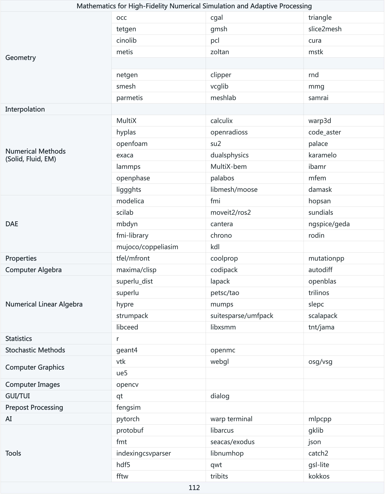

============================================

The FENGSim project serves as a software development kit (SDK) for high-fidelity manufacturing simulation and adaptive processing, integrating a variety of mathematical libraries such as computational geometry, computer algebra, numerical methods, numerical linear algebra, computer graphics, image processing, probability and statistics, optimization, and artificial intelligence. Central to the project are multi-x couplers tailored for intricate manufacturing applications. It also incorporates the CAX software framework along with practical examples.

Moreover, FENGSim offers tools for managing library dependencies, package management, and continuous integration and continuous deployment (CICD) processes, which include compiling, code merging, version control, testing, and deployment. The project also features interfaces for the integration of machinery and sensors, covering drivers, communication, and control applications. Additionally, FENGSim includes a large language model (LLM) assistant, developed using open-source code and classical literature, to enhance user experience and support.

To install FENGSim on Ubuntu 24.04:

```shell
	sudo apt install git
	git clone https://github.com/OpenDigitalTwin-Dev/FENGSim.git
	cd FENGSim/cli
	./install or ./uninstall
```
To launch the Qt project for FENGSim:

```shell
	cd FENGSim/cli
	./qtcreator
```
<div align="center">

</div>

There exist various solvers designed for nonlinear solid mechanics, computational fluid dynamics, computational electrodynamics, differential algebraic equations, particle methods, numerical linear algebra, and probability and statistics. These solvers can be obtained from Git by following the provided instructions.

```shell
	cd FENGSim
	git pull origin main
	git submodule init
	git submodule update docs
	git submodule update toolkit/CFD
	git submodule update toolkit/CEM
	git submodule update toolkit/DAE
	git submodule update toolkit/Particles
	git submodule update toolkit/NLA
	git submodule update toolkit/PS
	cd toolkit
	git clone https://github.com/OpenDigitalTwin-Dev/MultiX.git
```

Consequently, all the commands and the README.md files will be revised to be the rules and the notebooks in the Warp AI terminal.

This is really interesting. Since Warp operates as a terminal, it can use commands like grep and find to search for particular files, such as README.md, and also look for specific content, like installation instructions, within those files. The outcomes can then be input into the AI. As a result, our SDK is a great data source for Warp.

We will utilize Warp alongside our SDK to accomplish the following tasks:
1. Manage the SDK
2. Acquire background knowledge
3. Develop code
4. Enhance automation for CAD design, model simplification, structural mesh generation, path planning, and inverse modeling.

<div align="center">

</div>

[Docs](https://fengsim-docs.readthedocs.io)
============================================

Solutions
============================================

General
--------------------------------------------

<div align="center">

</div>

<div align="center">

</div>

<div align="center">

</div>

<div align="center">

</div>

Additive Manufacturing
--------------------------------------------

<!--
<div align="center">

</div>

<div align="center">

</div>
-->

Composite Materials
--------------------------------------------

<!--
<div align="center">

</div>
<div align="center">

</div>
<div align="center">

</div>
-->

Robotics
--------------------------------------------

<!--
<div align="center">

</div>
-->

Metrology
--------------------------------------------

<div align="center">

</div>
<div align="center">

</div>
<div align="center">

</div>

<div align="center">

</div>
