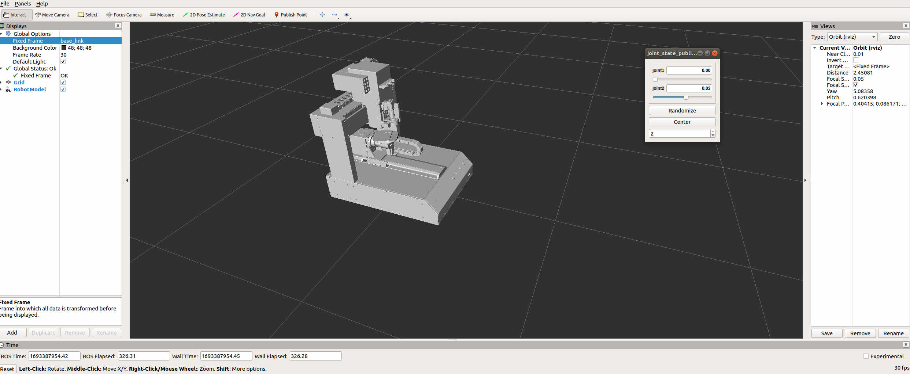

# [FENGSim](https://ocp-docs.readthedocs.io)

To install:
1. Navigate to the cli directory in your terminal/command prompt.
2. Run the install script by entering:
    ./install.sh
3. Once installation is complete, launch QtCreator with:
    ./qtcreator.sh 
4. In QtCreator, open the FENGSim.pro project file located at:
    starters/FENGSim/FENGSim.pro
5. Build the prepost module project in QtCreator.

The product life cycle includes design, manufacturing, operation, and maintenance. In the past, optimization of products focused on the design phase, often overlooking issues that arose in manufacturing, operation, and maintenance. This is where digital twins can help - by extending optimization across the entire product lifecycle. With digital twins, problems can be identified and solved not just in design, but even after production during real-world use. This allows products to be greatly improved through rapid iteration. Digital twins may thus accelerate innovations like manned missions to Mars. 

The FENGSim project is an open source project for additive manufacturing operation system.
1. Interfaces to mathematical libraries like computational geometry, computer algebra, numerical methods, numerical linear algebra, computer graphics and images, probability and statistics, optimization, etc..
2. Tools for library dependences, package managements, CICD (compile, codes merge, version control, test, deploy).
3. Interfaces and Tools for communication, device drivers, job managements to machines and sensors.
4. Physical simulations for manufacturing technologies.
   
# Additive Manufacturing

# Composite Materials

# Robotics

# Metrology

# Incubator

We have connections with many incubators. If you would like to obtain financial support, please contact us.

# [Logs](./logs/logs.md)

