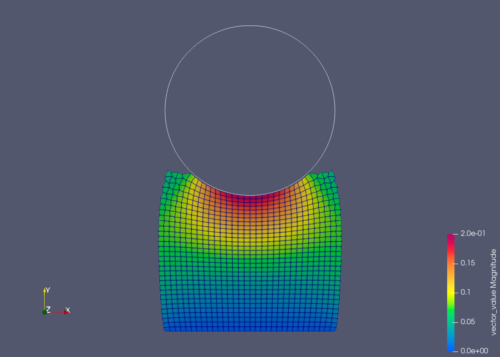
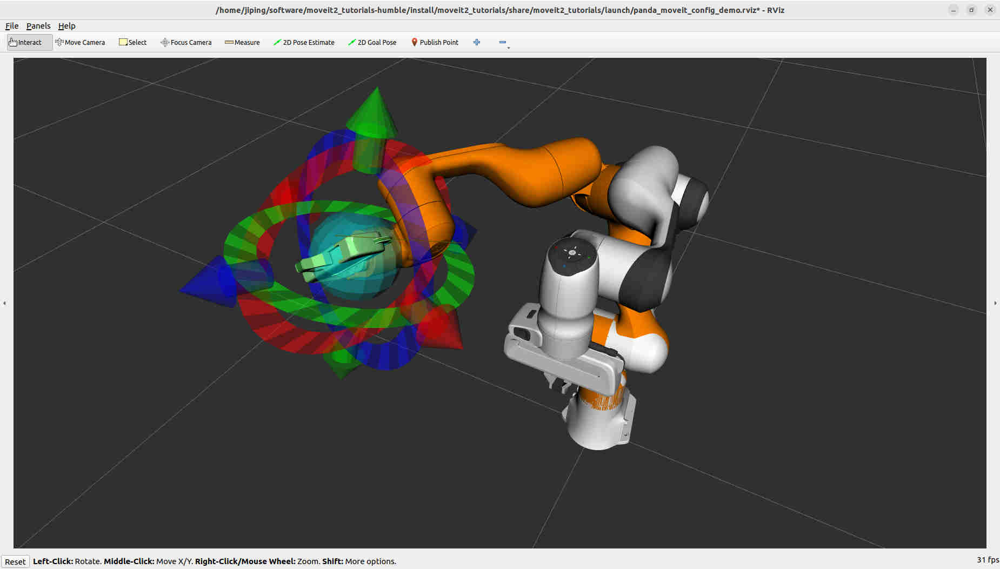
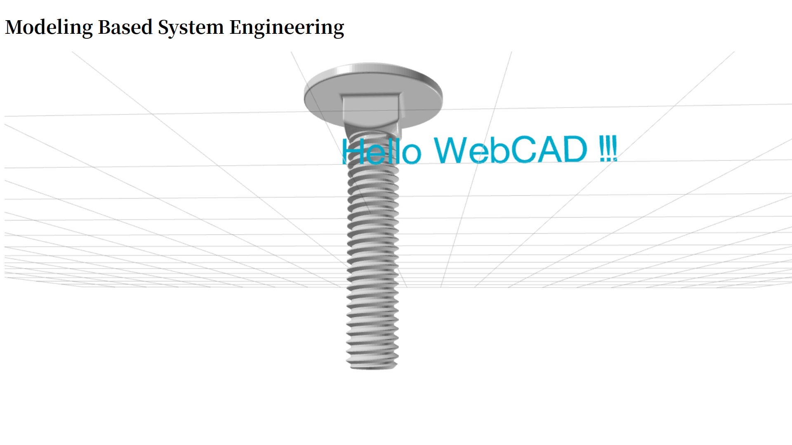

## FENGSim
   * qt5->qt6 (...)
   * vtk8->vtk9 (...)
   
## Mesh Generation
   * cgal 2d/3d triangulation and meshing (2023-08-23)

   
   * triangle (2023-09-23)
   

   
## Contact
   * Hello World! (2023-09-13)
   

   
   * Domain Decomposition Method, the Poisson equation (2023-08-23)
   * Domain Decomposition Method, the elasticity equation (...)
   
## ROS 
   * <mark>ros-dev-tools</mark> from <mark>infra-variants</mark> in <mark>ros-infrastructure</mark>
	 > This repository contains package configuration information and automation for the ROS Infrastructure variant packages. Currently there are two variants used for ROS Infrastructure. ros-build-essential contains the base set of packages to be present when building any ROS package on the build farm. ros-dev-tools contains packages that are of general use to ROS developers but which are not dependencies of any particular packages within a ROS distribution.
   * <mark>rosdep</mark> in <mark>ros-infrastructure</mark>
	 >rosdep is a command-line tool for installing system dependencies. For end-users, rosdep helps you install system dependencies for software that you are building from source. For developers, rosdep simplifies the problem of installing system dependencies on different platforms. Instead of having to figure out which debian package on Ubuntu Oneiric contains Boost, you can just specify a dependency on 'boost'.
   * <mark>colcon</mark>
	 >colcon is a command line tool to improve the workflow of building, testing and using multiple software packages. It automates the process, handles the ordering and sets up the environment to use the packages.
   * <mark>vcstool</mark>
	 >Vcstool is a version control system (VCS) tool, designed to make working with multiple repositories easier.
   * MoveIt sources and compilation (...)
   * Navigation sources and compilation (...)
   

   

## MBD
   * Hello World! (2023-10-24)
   

# QQ's words

One Two Three Four Five Six Seven Nine Ten

2023.11.21 everyone from grade paper cut 

2023.11.22 pig farm hen cow duck

2023.11.23 eleven twelve thirteen fourteen fifteen

2023.11.24 hour time work play read home

2023.11.27 book draw picture football park

2023.11.29 swim Monday Tuesday Wednesday zoo  

2023.11.30 see film Friday Staurday Sunday

2023.12.05 basketball grandma grandpa name each 

2023.12.06 animal parent weekend say special

2023.12.10 sing dance aunt museum her

2023.12.11 school today tomorrow sorry week

2023.12.12 uncle great chess boat nice

2023.12.18 eye body leg old big

