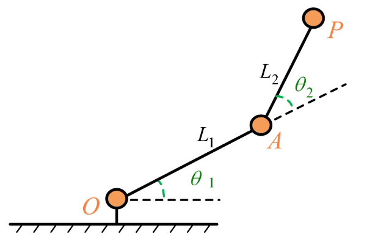

# 公式推导

## 正运动学（已知 $\theta_1, \theta_2$ 求末端 $(x, y)$）

末端位置：

$$
x = l_1 \cos(\theta_1) + l_2 \cos(\theta_1 + \theta_2)  \\
y = l_1 \sin(\theta_1) + l_2 \sin(\theta_1 + \theta_2)
$$

**推导思路**：

- 第一段末端坐标:

$$
(x_1, y_1) = (l_1\cos(\theta_1),\ l_1\sin(\theta_1))
$$
- 第二段末端坐标（整体末端）:

$$
(x, y) = (x_1 + l_2\cos(\theta_1 + \theta_2),\ y_1 + l_2\sin(\theta_1 + \theta_2))
$$

---

## 逆运动学（已知末端 $(x, y)$ 求 $\theta_1, \theta_2$）

1. 求 $\theta_2$ （利用余弦定理）：

$$
c_2 = \frac{x^2 + y^2 - l_1^2 - l_2^2}{2 l_1 l_2}
$$

$$
\theta_2 = \arccos(c_2)
$$
2. 求 $\theta_1$：

$$
k_1 = l_1 + l_2\cos(\theta_2)
$$

$$
k_2 = l_2\sin(\theta_2)
$$

$$
\theta_1 = \arctan2(y, x) - \arctan2(k_2, k_1)
$$


# C++ 代码实现

```cpp
// Positive kinematics
    Eigen::Vector2d forwardKinematics(double theta1, double theta2)
    {
        Eigen::Vector2d position;
        position.x() = L1_ * cos(theta1) + L2_ * cos(theta1 + theta2);
        position.y() = L1_ * sin(theta1) + L2_ * sin(theta1 + theta2);
        return position;
    }
```


```cpp
// Inverse Kinematics
    bool inverseKinematics(const Eigen::Vector2d& target, double& theta1, double& theta2)
    {
        double x = target.x();
        double y = target.y();
        
        // Check if the target is reachable
        double r_squared = x * x + y * y;
        double r = sqrt(r_squared);
        
        if (r > (L1_ + L2_) || r < fabs(L1_ - L2_))
        {
            RCLCPP_WARN(this->get_logger(), "Target location unreachable: (%.2f, %.2f)", x, y);
            return false;
        }
        
        // compute theta2
        double cos_theta2 = (r_squared - L1_ * L1_ - L2_ * L2_) / (2 * L1_ * L2_);
        cos_theta2 = std::max(-1.0, std::min(1.0, cos_theta2)); // Limited to the range [-1, 1]
        
        // Choose the elbow-up solution
        theta2 = acos(cos_theta2);
        
        // compute theta1
        double beta = atan2(L2_ * sin(theta2), L1_ + L2_ * cos(theta2));
        theta1 = atan2(y, x) - beta;
        
        // Normalized angle to [-π, π]
        theta1 = atan2(sin(theta1), cos(theta1));
        theta2 = atan2(sin(theta2), cos(theta2));
        
        return true;
    }
```


